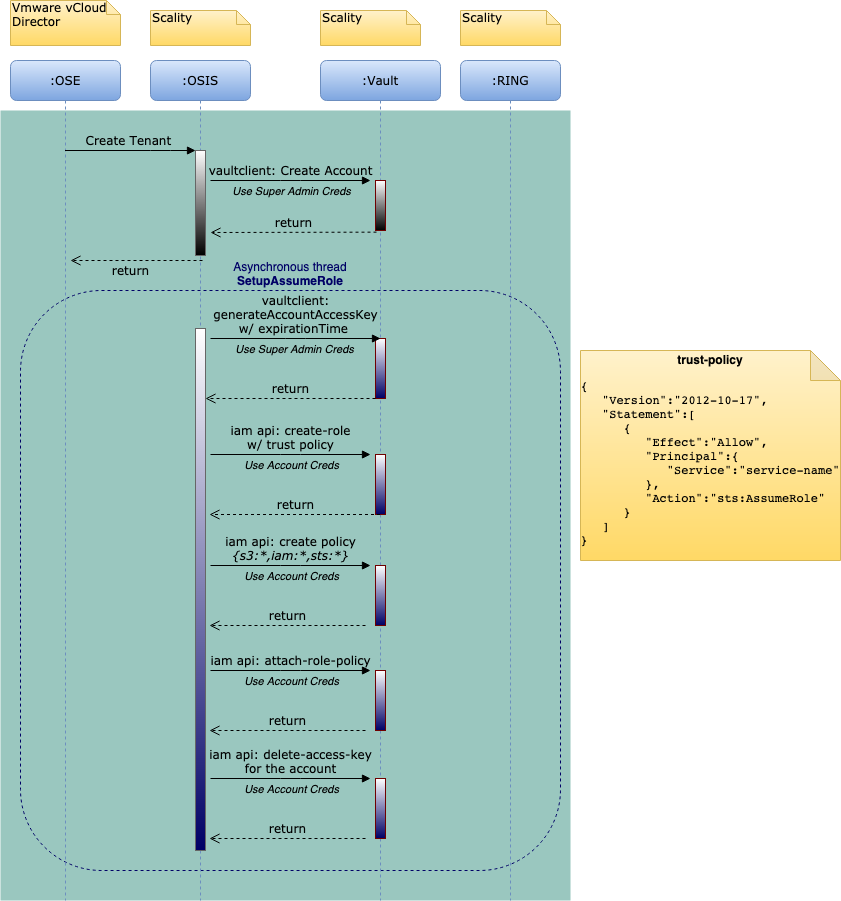
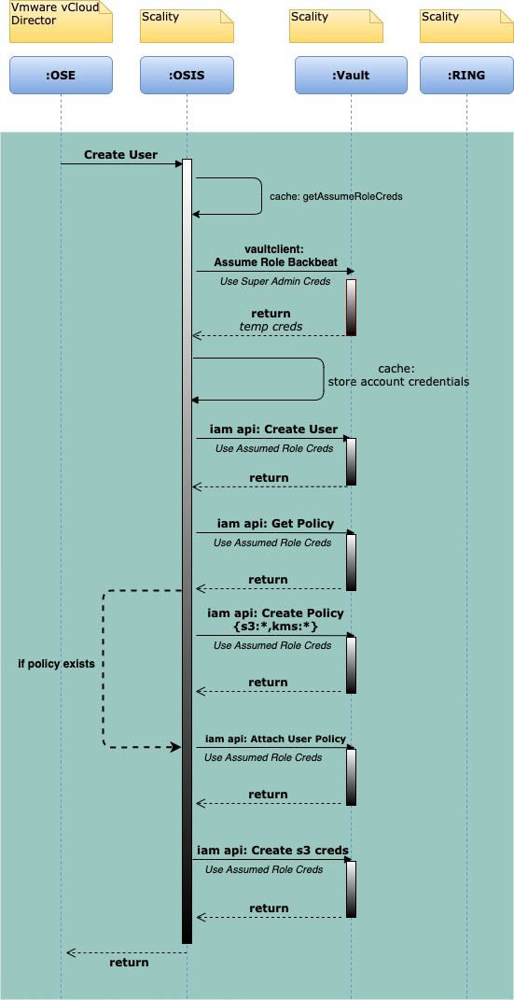
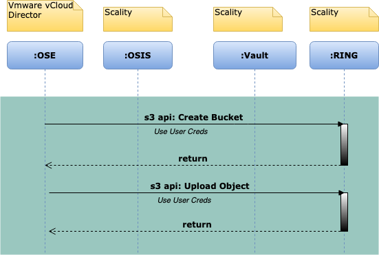

# Design for VCD OSE - OSIS
<details>
<summary><b>TABLE OF CONTENTS</b></summary>

* [OSIS inital setup](#osis-inital-setup)
   + [Activity Diagram for initial setup](#activity-diagram-for-initial-setup)
* [Tenant APIs](#tenant-apis)
   + [Create Tenant](#create-tenant)
   + [Create Tenant Example Activity Diagram](#create-tenant-example-activity-diagram)
   + [Query Tenants](#query-tenants)
   + [List Tenants](#list-tenants)
   + [Get Tenant](#get-tenant)
   + [Head Tenant](#head-tenant)
   + [Delete Tenant](#delete-tenant)
   + [Update Tenant](#update-tenant)
* [User APIs](#user-apis)
  + [Create User](#create-user)
  + [Create User Example Activity Diagram](#create-user-example-activity-diagram)
  + [Query Users](#query-users)
  + [List Users](#list-users)
  + [Get User w/ userid](#get-user-w--userid)
  + [Get User w/ canonical ID](#get-user-w--canonical-id)
  + [Head User](#head-user)
  + [Delete User](#delete-user)
  + [Update User](#update-user)
* [S3 Credential APIs](#s3-credential-apis)
  + [Create S3 Credential](#create-s3-credential)
  + [Query S3 Credentials](#query-s3-credentials)
  + [List S3 Credentials](#list-s3-credentials)
  + [Delete S3 Credential](#delete-s3-credential)
  + [Get S3 Credential](#get-s3-credential)
* [Miscellaneous APIs:](#miscellaneous-apis-)
  + [getProviderConsoleUrl](#getproviderconsoleurl)
  + [getTenantConsoleUrl](#gettenantconsoleurl)
  + [getS3Capabilities](#gets3capabilities)
  + [getInformation](#getinformation)
  + [updateOsisCaps (?)](#updateosiscaps----)
  + [getBucketList](#getbucketlist)
  + [getOsisUsage](#getosisusage)
* [S3 Operations Example Activity Diagram](#s3-operations-example-activity-diagram)
</details>

## OSIS inital setup

For the initial installation of OSIS application, following steps must be executed.
1. A **Super Admin** account will be created as part of S3C/Vault setup
1. Set OSE properties:
   1. S3 URL
   1. Admin Vault URL along with credentials as Super Admin access key/ secret key
    
_**Note: "Super Admin" account has full Account Management access and can use "AssumeRoleBackbeat" to assume a role of another Account.**_

## Tenant APIs
<u>**Important Assumptions:**</u>
* All the Tenant APIs on OSIS will use **Super Admin credentials** to manage on Vault.
* A Vault Account is equivalent of OSE Tenant.

### Create Tenant
This API creates a Tenant on Vault.  
1. Vault `create-account` api will be called using vaultclient. 
    * Tenant Name is stored as Account Name  
    * `cd_tenant_ids` list as part of the request to be stored as a property of the vault account.
    * Account ID to be sent back as storage tenant ID to OSE
1. `generate-account-access-key` for the account using vaultclient.
1. Create a role using generated access key with
   1. Role name : `osis` (So role-arn can be generated in the format `arn:aws:iam::[account-id]:role/osis`
   1. Trust policy
   ```json
    {
        "Version": "2012-10-17",
        "Statement": [{
            "Effect": "Allow",
            "Principal": {
                "Service": "service-name"
            },
            "Action": "sts:AssumeRole"
            }]
    }
   ```
1. `attach-role-policy` with s3 and iam full access to this role using generated access key
1. `delete-access-key` for the account.

### Create Tenant Example Activity Diagram


### List Tenants
This API will list tenants on Vault. 
1. Vault `list-accounts` api will be called using vaultclient.
   * This API can be called with following parameters:
        * `offset`:  The start index of tenants to return (optional)
        * `limit`: Maximum number of tenants to return (optional)
    
   **Scenarios:**
    1. If `offset` and `limit` values are not passed in the request:
        1. `list-accounts` api will be called with `max-items` with 1000 increments with each marker until `isTruncated` is `false` in the result. The consolidated Accounts list will be returned as Tenants list 
    1. If only `offset` is passed and `limit` value is not passed in the request:
       1. `list-accounts` api will be called with `max-items` with 1000 increments with each marker until `isTruncated` is `false` in the result. The sublist of the consolidated Accounts list from the provided `offset` will be returned as Tenants list
   1. If only `limit` is passed and `offset` value is not passed in the request:
      1. If `limit <= 1000`, `list-accounts` api will be called with `max-items` with `limit` value and the Accounts list will be returned as Tenants list.
      1. If `limit > 1000`, `list-accounts` api will be called with `max-items` with 1000 increments with each marker until `limit` has reached or `isTruncated` is `false` in the results. The consolidated Accounts list will be returned as Tenants list
    1. If both `offset` and `limit` values are passed in the request:
        1. If `(limit + offset) <= 1000`, `list-accounts` api will be called with `max-items` with `(limit + offset)` value and the Accounts list from the provided `offset` will be returned as Tenants list
        1. If `(limit + offset) > 1000`, `list-accounts` api will be called with `max-items` with 1000 increments with each marker until `(limit + offset)` has reached or `isTruncated` is `false` in the results. The sublist of the consolidated Accounts list from the provided `offset` will be returned as Tenants list.
    

### Query Tenants
This API will query tenants on Vault using a `filter` parameter.
1. Call [List Tenants](#List-Tenants) by passing `limit` and `offset` parameters from the request.
1. Filter the tenants from the result of step #1 using the `filter` parameter in the request
    * Usually the OSE passes `cd_tenant_id` field with value under `filter` parameter 

### Get Tenant
This API will return the tenant on Vault with `tenantID`.
1. Vault `get-account` api will be called using vaultclient with the provided `tenantID` as `AccountID`.

### Head Tenant
This API will check whether the tenant exists on Vault with `tenantID`.
1. Vault `get-account` api will be called using vaultclient with the provided `tenantID` as `AccountID`.
1. Return `true` or `false` if result is returned or not respectively.

### Delete Tenant
This API will delete the tenant on Vault. 

**Approach 1:**
1. Vault `delete-account` api will be called using vaultclient with the provided `tenantID` as `AccountID`.
1. Return error if account is not empty.

**Approach 2:**
1. Vault `delete-account` api will be called using vaultclient with the provided `tenantID` as `AccountID`.
   1. If error due to account not empty, execute all the APIs below using Assumed Role for the account _(See User APIs)_
        1. detach role policies 
        1. delete roles
        1. Remove users from groups
        1. delete users
        1. delete groups

**The final decision is yet to be concluded.**

### Update Tenant
This API will enable or disable the tenant

* HOLD the account option?
* (or) Not implement this API

**The final decision is yet to be concluded.**

## User APIs

### Assume Role behavior for all User APIs
* Use the tenant account credentials from the `assumeRoleCache` cache for the given account ID before each User API.
* If the tenant account credentials were not found in `assumeRoleCache`, `AssumeRoleBackbeat` api needs to be called as Super Admin 
* `assumeRoleCache` cache will be key-value pair of account_id and temporary credentials object respectively.
    * `assumeRoleCache` cache will have TTL.
    * Refresh the credentials periodically on the cache (AWS SDK `refresh()` will be used)
    * _[ A detailed cache design needs to be added ]_

### Create User
This API creates a user on Vault.
1. `create-user` api will be called using assumed role credentials.
    * `cd_user_id` is stored as username.
1. `attach-policy` for the new user will be called using the assumed role credentials with full S3 and IAM access permissions.
1. `create-s3credentials` api will be called using assumed role credentials

### Create User Example Activity Diagram


### Query Users
This API will query users on Vault using a `filter` parameter.
1. `list-users` api will be called using assumed role credentials.
1. Filter the result users using the `filter` parameter in the request

### List Users
This API will list users on Vault.
1. `list-users` api will be called using assumed role credentials.

### Get User w/ userid
This API will return the user.
1. `get-user` api will be called using assumed role credentials with cd_user_id as username.

### Get User w/ canonical ID
This API will return the user.
1. `get-user` api will be called using assumed role credentials with canonical_id as canonical_user_id?

### Head User
This API will return if user exists or not.
1. `get-user` api will be called using assumed role credentials with cd_user_id as username.
1. Return `true` or `false` if result is returned or not respectively.

### Delete User
This API will delete user on Vault.
1. `delete-user` api will be called using assumed role credentials.

### Update User
This API will enable or disable user on Vault.
1. `updateAccessKey` api will be called using assumed role credentials to disable/enable access keys for the user.

## S3 Credential APIs
### Common behavior for all S3 Credential APIs will be same as User APIs ([check here](#Assume-Role-behavior-for-all-User-APIs))


### Create S3 Credential
This API creates S3 credential for the user.
1. `generate-access-key` api will be called using assumed role credentials.

### Query S3 Credentials
This API query S3 credentials of the  user using a `filter` parameter.
1. `list-access-keys` api will be called using assumed role credentials.
1. Filter the result credentials using the `filter` parameter in the request.

### List S3 Credentials
This API list S3 credentials of the  user.
1. `list-access-keys` api will be called using assumed role credentials.

### Delete S3 Credential
This API deletes the S3 credential of the user.
1. `delete-access-key` api will be called using assumed role credentials.

### Get S3 Credential
This API return S3 credential of the user.
1. `get-access-key` api will be called using assumed role credentials.

## Miscellaneous APIs:

### getProviderConsoleUrl
Get the console URI of the platform or platform tenant if tenantId is specified
* Return supervisor URL (Static and needs to be maintained in Config)
* This is a tunable

### getTenantConsoleUrl 
Get the console URI of the platform or platform tenant if tenantId is specified
1. First iteration
    1. It is configuration in application.yml
    1. It is Url of the S3 console

1. Optional: we can provide some kind of SSO)
1. For Next Gen production, it will be the XDM ui

### getS3Capabilities 
Get S3 capabilities of the platform
* It is using an xml file to show s3 capabilities it’s a copy paste from ceph code)

### getInformation
Get the information of the REST Services, including platform name, OSIS version and etc (Static Details)
1. First Version, Make all information configuration except the usage part
1. Next Gen, Implement the usage tenant level part with UTAPIv2 (write -java utapi-client)

### updateOsisCaps (?)

### getBucketList
Get the bucket list of the platform tenant
* S3:`listBucket` API
### getOsisUsage 
Get the platform usage of global (without query parameter), tenant (with tenant_id) or user (only with user_id).
1. We don’t know yet what needs to be done here
1. For next generation,
    1. Utapi Service level -> global platform
    1. Utapi Account level -> tenant level
    1. Utapi User level -> user level


## S3 Operations Example Activity Diagram


